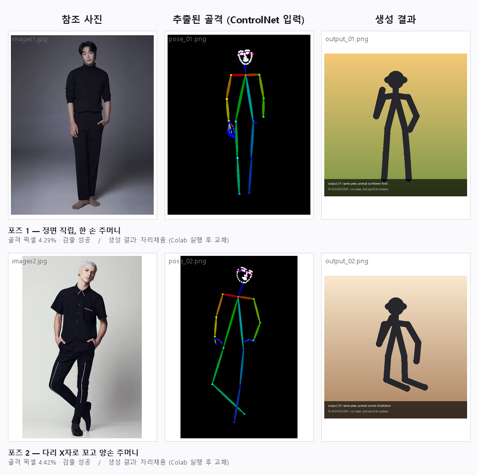
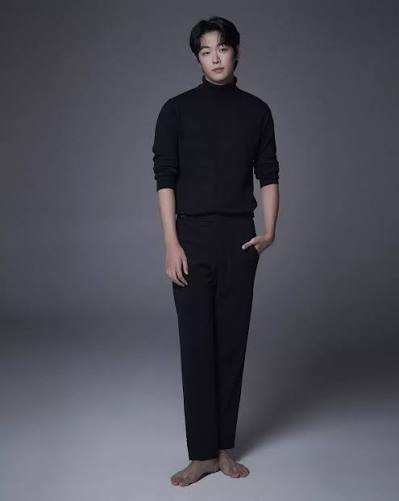
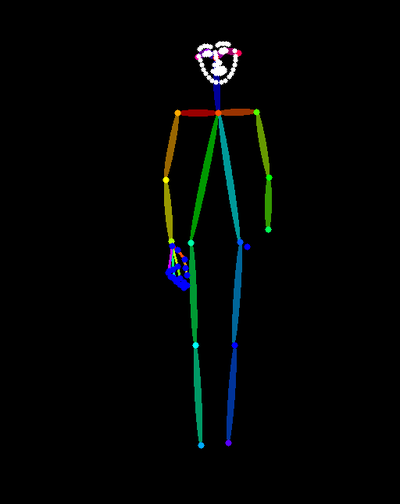
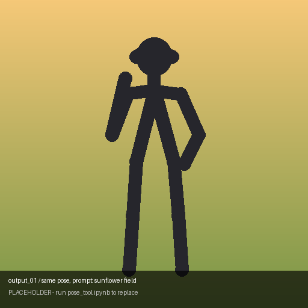
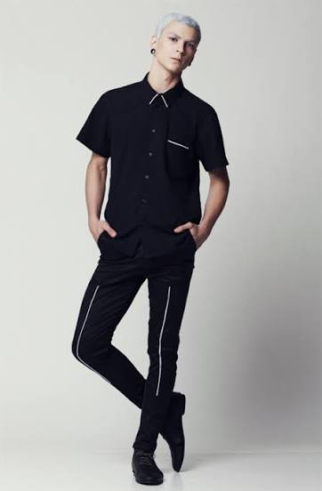
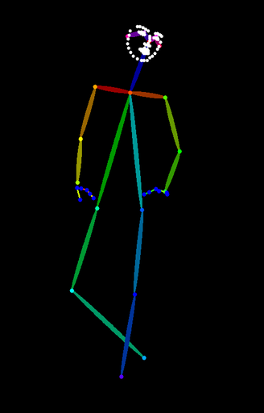
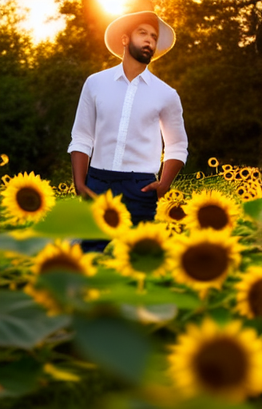

# 원하는 포즈로 이미지 만드는 도구

[](https://colab.research.google.com/github/Benji5526/pose-image-tool/blob/main/pose_tool.ipynb)

## 도구 설명
- 참조 사진에서 사람의 자세(골격)만 뽑아내고, 그 자세를 그대로 유지한 채 원하는 인물·스타일로 새 이미지를 만듭니다.
- OpenPose로 관절을 추출해 ControlNet 조건으로 넣고 Stable Diffusion 1.5로 생성합니다. 프롬프트는 한국어로 써도 되며 기기 안에서 영어로 번역합니다. API 키 없이 무료 Colab GPU에서 동작합니다.

## 사용법
1. `pose_tool.ipynb`를 클릭해 열고, [colab.research.google.com](https://colab.research.google.com) → 파일 → GitHub 탭에 이 저장소 주소를 넣어 실행합니다. 열린 뒤 **런타임 → 런타임 유형 변경 → T4 GPU**를 선택합니다.
2. 위에서부터 0~7단계 셀을 순서대로 실행합니다. 0 런타임 확인 → 1 설치(2~3분) → 2 참조 사진 업로드 → 3 골격 추출 → 4 모델 로드(첫 실행 시 4GB 다운로드) → 5 한 장 생성 → 6 조건 바꿔 비교(실험 1·2·3) → 7 저장. 실험 3에서 두 번째 참조 사진을 한 번 더 올립니다. 준비물은 전신이 나온 사진 2장이며, `samples/images1.jpg`와 `samples/images2.jpg`를 그대로 써도 됩니다.
3. 결과는 Colab 작업 폴더의 `samples/`에 `pose_01.png`(골격)·`output_01.png`(결과) 형태로 저장되고, 마지막 셀을 실행하면 `samples.zip`으로 내려받아집니다. 압축을 풀어 이 저장소의 `samples/`에 덮어쓰면 됩니다.
4. 직접 만든 프롬프트로 더 시도해 보려면 6-4단계 셀의 `MY_PROMPTS_KO`를 고쳐 실행하세요. **한국어로 써도 됩니다** — `to_en()`이 영어로 번역해 넘기고, 번역 결과를 화면에 함께 출력합니다. 쓸 만한 조합은 [`prompts.md`](prompts.md)의 "다음에 시도할 프롬프트 (작성 칸)"에 적어 두면 됩니다.

## 테스트 결과
- 포즈 1: 정면 직립, 양팔을 몸 옆에 내리고 한 손만 바지 주머니에 넣은 자세 (`samples/images1.jpg` → `samples/pose_01.png`) → 프롬프트: `a young man in a white linen shirt standing in a sunflower field, golden hour` → 결과: **잘 됨.** 골격 추출은 몸통·얼굴·양손 키포인트가 모두 잡혔고(픽셀 4.29%), 생성 결과도 직립 자세와 주머니에 넣은 손 위치까지 참조와 일치했습니다.
- 포즈 2: 다리를 X자로 꼬고 서서 양손을 주머니에 넣은 자세 (`samples/images2.jpg` → `samples/pose_02.png`) → 프롬프트: 포즈 1과 **동일** (프롬프트를 고정해 포즈만 바꾼 비교) → 결과: **일부 어긋남.** 골격은 꼰 다리의 교차 지점까지 정확히 잡혔지만(픽셀 4.42%), 생성 결과에서는 하체가 해바라기에 가려지고 상체만 정면 직립으로 나왔습니다. 양손을 주머니에 넣은 상체 자세는 맞았습니다.
- 노트북에는 조건을 하나씩만 바꾸는 실험 세 개가 들어 있습니다. 실험 1은 같은 포즈에 프롬프트 4종(sunflower field / knight / astronaut / anime), 실험 2는 같은 프롬프트에 `pose_scale` 0.5·1.0·1.5, 실험 3은 같은 프롬프트에 포즈 사진만 교체입니다. 관찰 내용은 노트북 마지막 마크다운 셀(9단계)에 기록합니다.

### 결과 미리보기



위는 여섯 칸을 한 장으로 합친 대조표입니다. 개별 파일은 아래 표에서 볼 수 있습니다.

| 참조 사진 | 추출된 골격 (ControlNet 입력) | 생성 결과 |
|:---:|:---:|:---:|
|  |  |  |
| **포즈 1** · 정면 직립, 한 손 주머니 | 골격 픽셀 4.29% · 검출 성공 | 자세 유지됨 |
|  |  |  |
| **포즈 2** · 다리 X자로 꼬고 양손 주머니 | 골격 픽셀 4.42% · 검출 성공 | 꼰 다리 재현 실패 |

표의 이미지는 모두 실제 실행 결과입니다. RTX 3070(8GB)에서 노트북을 끝까지
돌려 얻었습니다.

## 한계
- 손가락이 자주 깨집니다. 손 키포인트는 한 손에 21개뿐이라 정보가 부족해서이고, `steps`를 25 → 35로 올리면 나아집니다.
- 주머니에 손을 넣은 자세는 손이 몸에 가려 키포인트가 일부만 잡힙니다. 그만큼 손 모양은 프롬프트에 의존하게 됩니다.
- 참조 사진에서 팔다리가 잘려 있으면 골격이 아예 안 잡혀 검은 이미지가 나옵니다. 인물 전신이 크게 보이는 사진을 써야 합니다.
- 인물 수는 프롬프트가 아니라 골격 개수가 결정합니다. `two people`이라고 써도 골격이 하나면 한 명만 나옵니다.
- 옷 주름, 체형처럼 골격에 없는 정보는 제어되지 않아, 같은 자세여도 실행마다 몸의 두께나 옷 형태가 달라집니다.
- 포즈 2처럼 다리가 겹치는 자세는 골격은 정확히 잡히지만, 생성 단계에서 두 다리가 한 덩어리로 뭉치기 쉽습니다.
- 무료 Colab T4에서 해상도를 768 이상으로 올리면 `CUDA out of memory`가 납니다. 512px 기준 한 장에 약 15초입니다.
- 설치 단계에서 `controlnet_aux`가 `timm`을 0.6.7로 내리며 pip 의존성 경고를 냅니다. OpenPose 동작에는 영향이 없어 무시하면 됩니다.
- 한국어 프롬프트 번역은 `Helsinki-NLP/opus-mt-ko-en`을 쓰는데 **주어를 빠뜨릴 때가 있습니다.** "흰 셔츠를 입은 남자"가 "White shirt"로 줄어드는 식입니다. 인물·빛·화풍 낱말은 `HINTS` 표로 영어 표현을 덧붙여 보완했지만, 출력된 영어 문장을 확인하는 편이 안전합니다.
- 과제 안내의 FLUX.2-klein 4B 대신 SD 1.5를 씁니다. FLUX 계열은 OpenPose ControlNet 어댑터가 공개돼 있지 않아, "비슷한 모델" 범위에서 검증된 조합을 택했습니다.

## 폴더 구조

```
pose-image-tool/
├── README.md          # 이 파일 — 도구 설명, 사용법, 테스트 결과, 한계
├── pose_tool.ipynb    # Colab 튜토리얼 노트 (핵심, 34셀)
├── prompts.md         # 테스트에 쓴 프롬프트 모음
└── samples/
    ├── images1.jpg        # 참조 사진 1 (정면 직립)
    ├── pose_01.png        # images1에서 뽑은 골격 — ControlNet 입력
    ├── output_01.png      # 같은 자세로 만든 결과
    ├── images2.jpg        # 참조 사진 2 (다리 꼰 자세)
    ├── pose_02.png        # images2에서 뽑은 골격
    ├── output_02.png      # 같은 자세로 만든 결과
    └── preview.png        # 위 6장을 한 장으로 합친 대조표 (편집기에서 바로 보기용)
```

## 작업 기록

### 노트북 구성 (34셀 = 코드 18 + 마크다운 16)

| 단계 | 내용 |
|---|---|
| 0 | 런타임·GPU 확인 |
| 1 | `diffusers` / `controlnet_aux` 설치 |
| 2 | 참조 사진 업로드, 8의 배수 크기로 정리 |
| 3 | OpenPose 골격 추출 + 검출 성공 여부를 픽셀 비율로 자동 확인 |
| 4 | ControlNet(OpenPose) + SD 1.5 파이프라인 로드 |
| 5 | `generate()` 정의 후 한 장 생성 |
| 6 | 실험 1 같은 포즈·프롬프트 4종 / 실험 2 `pose_scale` 3종 / 실험 3 같은 프롬프트·포즈 교체 |
| 6-4 | **내 프롬프트로 직접 해보기** — `MY_PROMPTS_KO`에 문장을 채워 바로 실행하는 칸. 한국어를 쓰면 `to_en()`이 번역 |
| 7 | `samples/` 규칙대로 저장 후 `samples.zip` 다운로드 |
| 8 | 자주 막히는 지점 표 |
| 9 | 관찰 기록 (무엇을 바꿨고 어떻게 달라졌는가) |

모든 코드 셀 첫 줄에 `# 이 셀이 하는 일:` 주석을 달았습니다.

### 골격 추출 실행 결과

로컬에서 `controlnet_aux.OpenposeDetector`로 실제 추출했습니다. 노트북 2~3단계와 같은 코드 경로입니다.

| 참조 | 원본 크기 | 처리 크기 | 골격 픽셀 비율 | 판정 |
|---|---|---|---|---|
| `images1.jpg` | 399×501 | 400×504 | 4.29% | 검출 성공 |
| `images2.jpg` | 362×552 | 328×512 | 4.42% | 검출 성공 |

두 번 돌려 md5가 동일했습니다. 같은 사진이면 항상 같은 골격이 나옵니다.

관찰한 점:

- 얼굴 키포인트(눈·코·귀)까지 들어왔고, 포즈 2의 꼰 다리 교차 지점도 정확히 재현됐습니다.
- 주머니에 넣은 손은 옷에 가려 손 키포인트가 손목 근처에서 끊깁니다. 포즈 1은 한쪽만, 포즈 2는 양쪽 다 그렇습니다.

### Colab 실행 전에 미리 잡은 문제

노트북 코드를 로컬에서 실행해 보며 고친 것들입니다.

- `pipe.to("cuda")` 뒤에 `enable_model_cpu_offload()`를 부르면 `diffusers`가 오류를 냅니다 → 둘 중 하나만 호출하도록 수정
- `controlnet_aux`가 `timm<=0.6.7`을 강제해 pip가 의존성 경고를 냅니다 → 버전 핀을 `>=`로 완화하고 1단계에 "무시해도 되는 메시지" 안내 추가
- OpenPose의 손 그리기에 `matplotlib`이 필요합니다 (로컬에서 실제로 여기서 멈췄습니다) → Colab은 기본 설치라 문제없고, 8단계 표에 기재

### 남은 일

- [x] 4~7단계를 실행해 `output_01.png` / `output_02.png`를 실제 생성 결과로 교체 (로컬 RTX 3070, 120초)
- [x] 노트북 9단계 관찰 기록 채우기
- [x] 위 테스트 결과 채우기
- [ ] Colab T4에서도 한 번 돌려 동일하게 동작하는지 확인
